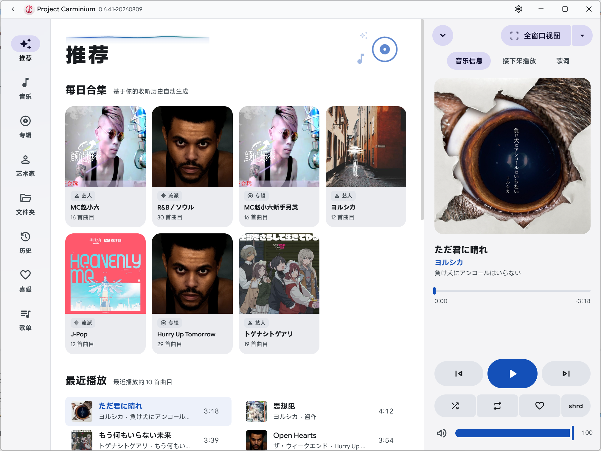
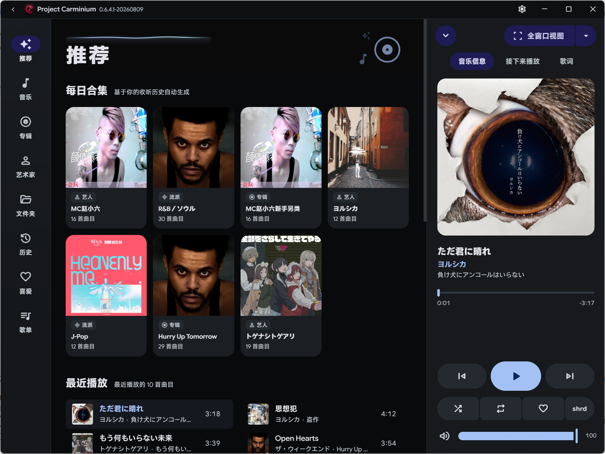

# Project Carminium



*浅色主题 — 侧边导航 + 电台页面*


*深色主题*

---

## 目录

- [🎧 普通用户](#-普通用户)
  - [功能一览](#功能一览)
  - [播放核心](#播放核心)
  - [音乐库](#音乐库)
  - [歌词体验](#歌词体验)
  - [界面与交互](#界面与交互)
  - [系统融合](#系统融合)
  - [下载](#下载)
- [⚙️ 技术用户](#️-技术用户)
  - [技术架构](#技术架构)
  - [技术栈](#技术栈)
  - [环境要求](#环境要求)
  - [快速开始（一次跑通）](#快速开始一次跑通)
  - [项目结构](#项目结构)
  - [npm 脚本参考](#npm-脚本参考)
  - [原生音频模块编译](#原生音频模块编译)
  - [FFmpeg / FFprobe 二进制](#ffmpeg--ffprobe-二进制)
  - [开发模式说明](#开发模式说明)
  - [生产构建](#生产构建)
  - [常见问题排查](#常见问题排查)
  - [许可证](#许可证)

---

## 🎧 普通用户

### 功能一览

| 功能 | 说明 |
|------|------|
| 🎵 本地音乐播放 | 支持 MP3、FLAC、OGG、WAV、M4A、AAC、Opus、WMA 等主流格式 |
| 🔊 原生音频输出 | 绕过浏览器音频栈，WASAPI 独占模式直通声卡，比特完美输出 |
| ✨ 无缝播放 | 曲目间零间隙切换，智能交叉淡入淡出 |
| 🎤 逐字歌词 | 多平台搜索（网易云 / QQ 音乐 / lrclib），逐字高亮同步滚动 |
| 🎨 动态主题 | Material Design 3，从专辑封面自动提取主题色 |
| 🌙 深色/浅色主题 | 完整的明暗双套界面 |
| 🌍 多语言 | 简体中文、繁體中文、日本語、English、Русский |
| 📻 Subsonic 远程流媒体 | 接入你的远程音乐服务器 |
| 💬 Windows 歌词集成 | 任务栏媒体控件 + 控制中心歌词显示 |
| ⌨️ 全局快捷键 | 播放/暂停、上下曲、音量、收藏、静音，全局生效 |
| 🎮 手柄支持 | 游戏手柄按键映射播放控制 |

### 播放核心

- **原生音频引擎** — Zig + miniaudio 直接驱动 WASAPI（Windows）/ PulseAudio（Linux），不经过 Chromium 音频栈，延迟更低、音质更好。
- **WASAPI 独占模式** — 独占访问音频设备，获得比特完美（bit-perfect）输出。
- **Gapless 无缝播放** — 曲目间零间隙切换，听专辑和现场录音不再有尴尬的停顿。
- **智能混音** — 基于曲目能量分析的自动交叉淡入淡出，过渡自然不突兀。
- **变速变调** — SoundTouch 实时调整播放速度（tempo）、音高（pitch）和速率（rate）。

### 音乐库

- **本地扫描** — 添加文件夹后自动扫描，支持增量更新，文件变动实时响应。
- **丰富格式** — MP3、FLAC、OGG、WAV、M4A、AAC、Opus、WMA 等全覆盖。
- **Subsonic / OpenSubsonic** — 连接你的 NAS 或远程服务器，流式播放云端音乐库，支持本地缓存。

### 歌词体验

- **多源搜索** — 自动从网易云音乐、QQ 音乐、lrclib、AMLLDB 搜索歌词。
- **逐字同步** — 逐字高亮跟随播放进度，支持翻译歌词和罗马音显示。
- **样式自定义** — 渐进模糊效果、居中对齐、字体大小可调。
- **悬浮歌词窗** — 独立悬浮窗口，不遮挡主界面。

### 界面与交互

- **Material Design 3** — Google 最新设计语言，动态取色（Monet）从专辑封面或系统壁纸提取主题色。
- **流畅动画** — GSAP 驱动的页面过渡与交互动效。
- **视频背景** — 支持视频作为播放页背景，沉浸感拉满。
- **自定义标题栏** — 无边框窗口 + 自绘标题栏，视觉统一。
- **5 种语言** — 简体中文、繁體中文、日本語、English、Русский，一键切换。

### 系统融合

- **Windows SMTC** — 任务栏媒体控件直接操控播放，系统控制中心显示歌曲信息与歌词。
- **全局快捷键** — 即使窗口在后台，也能用快捷键控制播放。
- **游戏手柄** — 支持手柄按键映射，躺椅上也能切歌。

### 下载

前往 [发布](https://github.com/Seirai-Haraguchi/Project-Carminium/releases) 页面获取最新版本便携版 `.exe`，解压即用，无需安装。

---

## ⚙️ 技术用户

### 技术架构

```
┌──────────────────────────────────────────────────────────────┐
│                      Electron 主进程                          │
│                                                              │
│  ┌──────────┐  ┌──────────┐  ┌───────────┐  ┌────────────┐ │
│  │ Settings  │  │ Library  │  │  Player   │  │ CoverServer│ │
│  │ (JSON)    │  │ (SQLite) │  │ (Queue)   │  │ (HTTP)     │ │
│  └──────────┘  └──────────┘  └─────┬─────┘  └────────────┘ │
│                                    │                         │
│  ┌──────────┐  ┌──────────┐       │   ┌──────────────┐     │
│  │  SMTC    │  │  Bridge  │◄──────┘   │  Subsonic    │     │
│  │ (IPC)    │  │  (IPC)   │           │  (API Client)│     │
│  └──────────┘  └─────┬─────┘           └──────────────┘     │
│                      │                                       │
│                ┌─────▼─────┐                                 │
│                │  WASAPI   │  koffi FFI → carminium_audio.dll│
│                │ (Native)  │  FFmpeg 子进程解码              │
│                └───────────┘                                 │
└──────────────────────────────────────────────────────────────┘
                       │ IPC (contextBridge)
┌──────────────────────▼───────────────────────────────────────┐
│                    渲染进程 (Chromium)                         │
│                                                              │
│  Web Audio API (合成/Gapless/Crossfade/EQ)                    │
│  GSAP 动画  │  M3 主题  │  i18n  │  Virtual List             │
└──────────────────────────────────────────────────────────────┘
```

### 技术栈

| 层级 | 技术 |
|------|------|
| 框架 | Electron 43 (Chromium ≥126 / Node.js ≥22) |
| 前端 | 原生 HTML/CSS/JS（无构建步骤，直接加载） |
| 动画 | GSAP 3.15 |
| 数据库 | better-sqlite3 (SQLite) |
| 原生 FFI | koffi（加载 Zig 编译的 DLL/SO） |
| 音频解码 | FFmpeg / FFprobe（外部二进制） |
| 原生音频 | Zig + miniaudio + SoundTouch |
| 图片处理 | sharp |
| 元数据 | music-metadata |
| 拼音排序 | pinyin-pro |

---

### 环境要求

#### 必需工具

| 工具 | 版本要求 | 说明 |
|------|----------|------|
| **Node.js** | ≥ 22.x（推荐 22 LTS） | Electron 43 内置 Node.js ABI |
| **npm** | ≥ 10.x | 随 Node.js 安装 |
| **Git** | 任意最新版本 | 克隆仓库 |
| **Zig** | 0.16.0 | 编译原生音频模块 `carminium_audio.dll` |

#### Windows 额外依赖

原生 Node 模块（better-sqlite3、sharp）编译需要以下工具：

| 工具 | 说明 |
|------|------|
| **Visual Studio Build Tools 2022** | 勾选「使用 C++ 的桌面开发」工作负载 |
| **Python 3.x** | node-gyp 依赖（≥ 3.10） |

> 安装 Visual Studio Build Tools 时，务必在安装器中勾选 **「使用 C++ 的桌面开发」(Desktop development with C++)** 工作负载。这会安装 MSVC 编译器、Windows SDK 等 node-gyp 所需的组件。

#### Linux 额外依赖

```bash
# Debian/Ubuntu
sudo apt install -y build-essential python3 pkg-config \
  libasound2-dev libpulse-dev libgtk-3-0 libnss3 libxss1 libxtst6 \
  libatspi2.0-0 libdrm2 libgbm1
```

---

### 快速开始（一次跑通）

以下步骤从零开始，按照顺序执行即可在本地启动开发环境。

#### 第 1 步：安装 Node.js

访问 [Node.js 官网](https://nodejs.org/) 下载并安装 **LTS 版本**（≥ 22.x）。

验证安装：

```powershell
node --version   # 应输出 v22.x.x 或更高
npm --version    # 应输出 10.x.x 或更高
```

#### 第 2 步：安装 Visual Studio Build Tools（仅 Windows）

1. 下载 [Visual Studio Build Tools 2022](https://visualstudio.microsoft.com/visual-cpp-build-tools/)
2. 运行安装器，勾选 **「使用 C++ 的桌面开发」**
3. 确保包含以下组件：
   - MSVC v143 - VS 2022 C++ x64/x86 生成工具
   - Windows 11 SDK（或 Windows 10 SDK）
4. 同时安装 [Python 3](https://www.python.org/downloads/)（勾选 Add to PATH）

#### 第 3 步：安装 Zig

1. 访问 [Zig 官网](https://ziglang.org/download/) 下载 **0.16.0** 版本
2. 解压到任意目录（如 `C:\zig`）
3. 将 Zig 的 `bin` 子目录添加到系统 `PATH` 环境变量

验证安装：

```powershell
zig version    # 应输出 0.16.0
```

#### 第 4 步：克隆仓库

```powershell
git clone https://github.com/Seirai-Haraguchi/Project-Carminium.git carminium
cd carminium
```

#### 第 5 步：安装 npm 依赖

```powershell
npm install
```

此命令会：
- 安装所有 `dependencies` 和 `devDependencies`
- 自动执行 `postinstall` 脚本：`electron-builder install-app-deps`（安装 Electron 原生依赖）

> **如果 `npm install` 报错**，通常是因为 Visual Studio Build Tools 未正确安装。请确认第 2 步已完成。

#### 第 6 步：重建原生模块

Electron 使用自己的 Node.js ABI，需要为 Electron 重新编译原生模块（better-sqlite3）：

```powershell
npm run rebuild
```

此命令执行 `electron-rebuild -f -w better-sqlite3`，强制为 Electron 的 ABI 重新编译 better-sqlite3。

#### 第 7 步：编译原生音频模块

```powershell
npm run build:native
```

此命令执行 `cd native && zig build copy -Doptimize=ReleaseFast`，编译 Zig 源码 + miniaudio C 源码，生成 `carminium_audio.dll` 并复制到 `electron/bin/win32/` 目录。

#### 第 8 步：确认 FFmpeg / FFprobe 二进制

项目需要 FFmpeg 和 FFprobe 二进制文件放在 `electron/bin/` 目录下。检查是否已存在：

```powershell
dir electron\bin\ffmpeg.exe
dir electron\bin\ffprobe.exe
```

如果文件不存在，请下载：
1. 访问 [FFmpeg 官网](https://ffmpeg.org/download.html) 或 [gyan.dev Windows 构建](https://www.gyan.dev/ffmpeg/builds/)
2. 下载 Windows 64-bit 构建版本
3. 从中提取 `ffmpeg.exe` 和 `ffprobe.exe`
4. 放入 `electron/bin/` 目录

> Linux 用户：`sudo apt install ffmpeg`，然后创建符号链接或复制到 `electron/bin/`。

#### 第 9 步：启动开发模式

```powershell
npm run dev
```

此命令以 `--dev` 参数启动 Electron，会自动打开 DevTools（分离窗口模式）。

---

### 一键安装（Windows）

如果已安装好所有前置工具（Node.js、Zig、VS Build Tools、Python），可以快速执行：

```powershell
git clone https://github.com/Seirai-Haraguchi/Project-Carminium.git carminium
cd carminium
npm run install:win
npm run build:native
npm run dev
```

其中 `npm run install:win` 等价于 `npm install && npm run rebuild`。

---

### 项目结构

```
carminium/
├── electron/                  # Electron 主进程
│   ├── main.js                # 主进程入口（窗口管理、AUMID 注册、生命周期）
│   ├── preload.js             # 预加载脚本（contextBridge IPC 桥接）
│   ├── settings.js            # 设置持久化（JSON → %APPDATA%/Carminium/）
│   ├── library.js             # 音乐库管理（SQLite、元数据、扫描）
│   ├── player.js              # 播放器（队列、随机/循环、Gapless/AutoMix）
│   ├── wasapi.js              # 原生音频渲染（koffi FFI → carminium_audio.dll）
│   ├── bridge.js              # IPC Bridge（Main↔Renderer 通信中枢）
│   ├── cover-server.js        # 封面/媒体 HTTP 服务器（127.0.0.1 随机端口）
│   ├── smtc.js                # Windows SMTC 系统媒体传输控制
│   ├── subsonic.js            # Subsonic/OpenSubsonic API 客户端
│   ├── lyrics.js              # 歌词搜索（网易云/QQ/lrclib/AMLLDB）
│   ├── auto_refresh.js        # 库自动刷新（FileWatcher + 远程 re-sync）
│   ├── memory_manager.js      # 主进程内存管理（监控/GC/资源回收）
│   ├── analysis_cache.js      # 智能过渡分析缓存
│   ├── osu_beatmap_provider.js# osu! 谱面数据提供器（过渡分析）
│   ├── sortkey.js             # 排序键生成（拼音/首字母）
│   ├── qrc_decrypt.js         # QQ 音乐 QRC 歌词解密
│   ├── bin/                   # 原生二进制文件
│   │   ├── carminium_audio.dll    # Zig 编译的音频渲染库
│   │   ├── ffmpeg.exe             # FFmpeg 解码器
│   │   └── ffprobe.exe            # FFprobe 探测器
│   └── bass/                  # BASS 音频库（预留，当前为空）
│
├── native/                    # 原生模块源码
│   ├── build.zig              # Zig 构建脚本
│   ├── carminium_audio.zig    # 音频渲染主逻辑（WASAPI/PulseAudio）
│   ├── miniaudio.h            # miniaudio 单头文件库
│   ├── miniaudio_impl.c       # miniaudio 实现文件
│   ├── soundtouch_wrapper.*   # SoundTouch 变速变调封装
│   ├── soundtouch/            # SoundTouch 源码（子模块）
│   └── zig-out/               # Zig 构建输出
│
├── web/                       # 前端（渲染进程）
│   ├── index.html             # 主页面
│   ├── floating.html          # 悬浮歌词窗页面
│   ├── style.css              # 全局样式（M3 设计系统）
│   ├── app.js                 # 应用入口
│   ├── audio_engine.js        # Web Audio API 引擎（合成/Gapless/Crossfade）
│   ├── audio_mixer.js         # 音频混音器
│   ├── audio_buffer_cache.js  # 音频缓冲区缓存
│   ├── bridge.js              # 前端 IPC Bridge 客户端
│   ├── cover_cache.js         # 封面缓存
│   ├── format_detector.js     # 音频格式检测
│   ├── gamepad.js             # 游戏手柄输入
│   ├── gsap.min.js            # GSAP 动画库
│   ├── i18n.js                # 国际化（5 种语言）
│   ├── memory_manager.js      # 渲染进程内存管理
│   ├── titlebar.js            # 自定义标题栏逻辑
│   ├── track_analyzer.js      # 曲目能量分析
│   ├── transition_planner.js  # 智能过渡规划
│   ├── ui_state_sync.js       # UI 状态同步
│   ├── video_background.js    # 视频背景
│   ├── virtual_list.js        # 虚拟列表（大量曲目渲染优化）
│   ├── fonts/                 # 字体文件
│   ├── worklets/              # AudioWorklet 处理器
│   └── pages/                 # 页面模块
│       ├── music.js           # 音乐浏览页
│       ├── now_playing.js     # 正在播放页（主交互界面）
│       ├── settings.js        # 设置页
│       ├── albums.js          # 专辑页
│       ├── artists.js         # 艺术家页
│       ├── playlists.js       # 播放列表页
│       ├── folders.js         # 文件夹管理页
│       ├── liked.js           # 喜爱曲目页
│       ├── history.js         # 播放历史页
│       ├── your_mix.js        # 智能混音页
│       ├── about.js           # 关于页
│       ├── context_menu.js    # 右键菜单
│       ├── floating.js        # 悬浮窗逻辑
│       └── utils.js           # 通用工具函数
│
├── scripts/                   # 辅助脚本
│   ├── start-electron.js      # Electron 启动器（清理环境变量）
│   └── diagnose-smtc.js       # SMTC 诊断工具
│
├── docs/screenshots/          # 截图资源
├── build/                     # 构建资源
│   ├── icon.png               # 应用图标（PNG 源）
│   └── icon-512.png           # 高分辨率图标
│
├── Fonts/                     # 额外字体
├── RinUI/                     # RinUI 配置（Windows 主题）
├── package.json               # 项目配置与依赖
├── version.json               # 版本信息
└── .gitignore
```

---

### npm 脚本参考

| 命令 | 说明 |
|------|------|
| `npm install` | 安装依赖（自动执行 postinstall: install-app-deps） |
| `npm run install:win` | Windows 一键安装（= npm install + npm run rebuild） |
| `npm run install:linux` | Linux 一键安装（同上） |
| `npm run rebuild` | 为 Electron 重新编译 better-sqlite3 原生模块 |
| `npm run build:native` | 编译原生音频库（Zig → carminium_audio.dll，Windows） |
| `npm run build:native:linux` | 交叉编译 Linux 版原生音频库（.so） |
| `npm run build:native:all` | 编译 Windows + Linux 双平台原生库 |
| `npm start` | 启动 Electron（生产模式） |
| `npm run dev` | 启动 Electron（开发模式，自动打开 DevTools） |
| `npm run build` | 构建便携版 .exe（electron-builder --win） |
| `npm run build:dir` | 构建到目录（不打包，用于测试） |
| `npm run build:portable` | 构建便携版 .exe |
| `npm run build:all` | 完整构建（原生库 + rebuild + 打包） |
| `npm run build:linux` | 构建 Linux 版（deb + AppImage） |
| `npm run build:linux-deb` | 构建 Linux deb 包 |
| `npm run build:linux-portable` | 构建 Linux AppImage |
| `npm run build:cross-win-linux` | 交叉构建 Windows + Linux 全平台 |

---

### 原生音频模块编译

原生音频模块 `carminium_audio.dll`（Windows）/ `carminium_audio.so`（Linux）是 Carminium 的核心音频渲染后端，由 Zig + miniaudio + SoundTouch 编译而成。

#### 构建流程

```powershell
# Windows 原生构建
npm run build:native
# 实际执行: cd native && zig build copy -Doptimize=ReleaseFast
```

构建过程：
1. Zig 编译 `carminium_audio.zig`（音频渲染主逻辑）
2. Zig 编译 `miniaudio_impl.c`（miniaudio C 实现）
3. 链接 Windows 系统库：`ole32`、`ksuser`、`avrt`、`winmm`（WASAPI 依赖）
4. 生成 `carminium_audio.dll`
5. 复制到 `electron/bin/win32/carminium_audio.dll`

#### DLL 查找路径

`wasapi.js` 按以下顺序查找原生库：

1. `electron/bin/win32/carminium_audio.dll`（平台子目录，优先）
2. `electron/bin/carminium_audio.dll`（兼容旧结构）
3. `native/zig-out/bin/carminium_audio.dll`（开发构建输出）

#### 手动构建（不通过 npm）

```powershell
cd native
zig build copy -Doptimize=ReleaseFast
```

#### Linux 交叉编译（在 Windows 上）

```powershell
npm run build:native:linux
# 实际执行: cd native && zig build copy -Doptimize=ReleaseFast -Dtarget=x86_64-linux-gnu
```

---

### FFmpeg / FFprobe 二进制

Carminium 使用 FFmpeg 子进程进行音频解码，使用 FFprobe 探测媒体信息。这两个二进制文件不包含在 Git 仓库中，需要手动放置。

#### Windows

1. 下载 FFmpeg Windows 构建：[gyan.dev](https://www.gyan.dev/ffmpeg/builds/) 或 [BtbN](https://github.com/BtbN/FFmpeg-Builds/releases)
2. 提取 `ffmpeg.exe` 和 `ffprobe.exe`
3. 放到 `electron/bin/` 目录：

```
electron/bin/ffmpeg.exe
electron/bin/ffprobe.exe
```

#### Linux

```bash
# 安装系统包
sudo apt install ffmpeg

# 创建符号链接到 electron/bin/
ln -s $(which ffmpeg) electron/bin/ffmpeg
ln -s $(which ffprobe) electron/bin/ffprobe
```

> **注意**：FFmpeg/FFprobe 文件较大（各约 144MB），因此未纳入 Git 版本控制。生产构建时 electron-builder 会将它们打包到 asar.unpacked 中。

---

### 开发模式说明

```powershell
npm run dev
```

开发模式特性：
- 自动打开 DevTools（分离窗口模式）
- 按 `F12` 切换 DevTools 开关
- 设置存储在 `%APPDATA%\Carminium\settings.json`
- 数据库存储在 `%APPDATA%\Carminium\library.db`
- 封面 HTTP 服务器监听 `127.0.0.1` 随机端口

#### 设置数据位置

| 平台 | 路径 |
|------|------|
| Windows | `%APPDATA%\Carminium\` |
| Linux | `~/.config/Carminium/` |

包含文件：
- `settings.json` — 用户设置
- `library.db` — SQLite 音乐库数据库
- `app-icon.ico` — 自动生成的 ICO 图标（SMTC 用）

#### 开发调试技巧

- **DevTools Console** — 查看 IPC 通信、Bridge 事件、音频引擎日志
- **主进程日志** — 终端输出（AUMID 注册、原生库加载、FFmpeg 进程等）
- **SMTC 诊断** — 运行 `node scripts/diagnose-smtc.js` 排查 SMTC 问题
- **原生库加载失败** — 检查 `electron/bin/win32/carminium_audio.dll` 是否存在
- **音频无法播放** — 检查 `electron/bin/ffmpeg.exe` 是否存在

---

### 生产构建

#### Windows 便携版

```powershell
# 完整构建（推荐）
npm run build:all
# 等价于: build:native + rebuild + build

# 仅打包（已编译好原生模块）
npm run build
# 输出: dist-electron/Project Carminium-<version>-portable.exe
```

#### 构建目录（用于测试）

```powershell
npm run build:dir
# 输出: dist-electron/win-unpacked/
# 可直接运行 win-unpacked/Project Carminium.exe
```

#### Linux 构建

```powershell
# deb + AppImage
npm run build:linux

# 仅 deb
npm run build:linux-deb

# 仅 AppImage
npm run build:linux-portable
```

#### 构建配置

构建配置在 `package.json` 的 `"build"` 字段中：

- **appId**: `Yunofactory.ProjectCarminium.Player`
- **productName**: `Project Carminium`
- **输出目录**: `dist-electron/`
- **Windows 目标**: portable (x64)
- **Linux 目标**: deb + AppImage (x64)
- **asarUnpack**: better-sqlite3、koffi、sharp、原生二进制（这些原生模块不能在 asar 内运行）

---

### 常见问题排查

### 1. `npm install` 失败

**原因**：原生模块（better-sqlite3、sharp）编译失败。

**解决**：
- 确认已安装 Visual Studio Build Tools 2022 并勾选「使用 C++ 的桌面开发」
- 确认已安装 Python 3 并在 PATH 中
- 尝试清除缓存后重装：
  ```powershell
  rm -r node_modules
  npm cache clean --force
  npm install
  ```

### 2. `npm run rebuild` 失败

**原因**：better-sqlite3 无法为 Electron ABI 重新编译。

**解决**：
- 确认 Electron 版本：`npx electron --version`
- 手动指定 Electron 版本重建：
  ```powershell
  npx electron-rebuild -f -w better-sqlite3 --version=43.2.0
  ```

### 3. `npm run build:native` 失败

**原因**：Zig 编译错误。

**解决**：
- 确认 Zig 版本：`zig version`（需要 0.16.0）
- 确认在 `native/` 目录下有 `carminium_audio.zig`、`miniaudio.h`、`miniaudio_impl.c`
- 尝试手动构建查看详细错误：
  ```powershell
  cd native
  zig build copy -Doptimize=ReleaseFast
  ```

### 4. 启动后无声音

**排查步骤**：
1. 检查终端是否有 `[wasapi] Native library not found` 错误
2. 确认 `electron/bin/carminium_audio.dll` 或 `electron/bin/win32/carminium_audio.dll` 存在
3. 检查 `electron/bin/ffmpeg.exe` 是否存在
4. 在设置中将音频 API 切换为「共享模式」试试
5. 查看 DevTools Console 中的音频引擎日志

### 5. SMTC 显示"未知应用"

**原因**：Windows 24H2 的 SMTC AUMID 注册问题。

**解决**：
- 运行诊断脚本：`node scripts/diagnose-smtc.js`
- 确认 `build/icon.png` 存在（用于生成 ICO）
- 检查注册表 `HKCU\Software\Classes\AppUserModelId\Yunofactory.ProjectCarminium.Player`
- 开发模式下此问题可能反复出现（electron.exe 路径变化），属正常现象

### 6. 启动后白屏

**原因**：页面加载失败。

**解决**：
- 检查 `web/index.html` 是否存在
- 查看 DevTools Console 的 `did-fail-load` 错误
- 确认 `electron/preload.js` 存在且无语法错误

### 7. 音乐库为空

**原因**：未添加音乐文件夹。

**解决**：
1. 打开应用 → 设置 → 音乐文件夹
2. 添加包含音频文件的目录
3. 等待扫描完成（状态栏会显示进度）

### 8. PowerShell 中 `&&` 不工作

PowerShell 旧版本不支持 `&&` 运算符。使用 `;` 分隔命令，或升级到 PowerShell 7+。

---

## 版本信息

| 项目 | 值 |
|------|-----|
| 版本 | 0.6.3-1.20260808 |
| 代号 | Shiroko |
| 许可证 | LGPL-3.0-or-later |
| 作者 | Seirai Haraguchi |

版本信息定义在 `version.json` 中。

---

## 许可证

本项目基于 [LGPL-3.0-or-later](https://www.gnu.org/licenses/lgpl-3.0.html) 许可证发布。

第三方组件许可证：
- [miniaudio](https://github.com/mackron/miniaudio) — MIT / Public Domain
- [SoundTouch](https://gitlab.com/soundtouch/soundtouch) — LGPL-2.1
- [GSAP](https://greensock.com/gsap/) — GreenSock Standard License
- [FFmpeg](https://ffmpeg.org/) — LGPL-2.1+ / GPL-2.0+（取决于构建配置）
