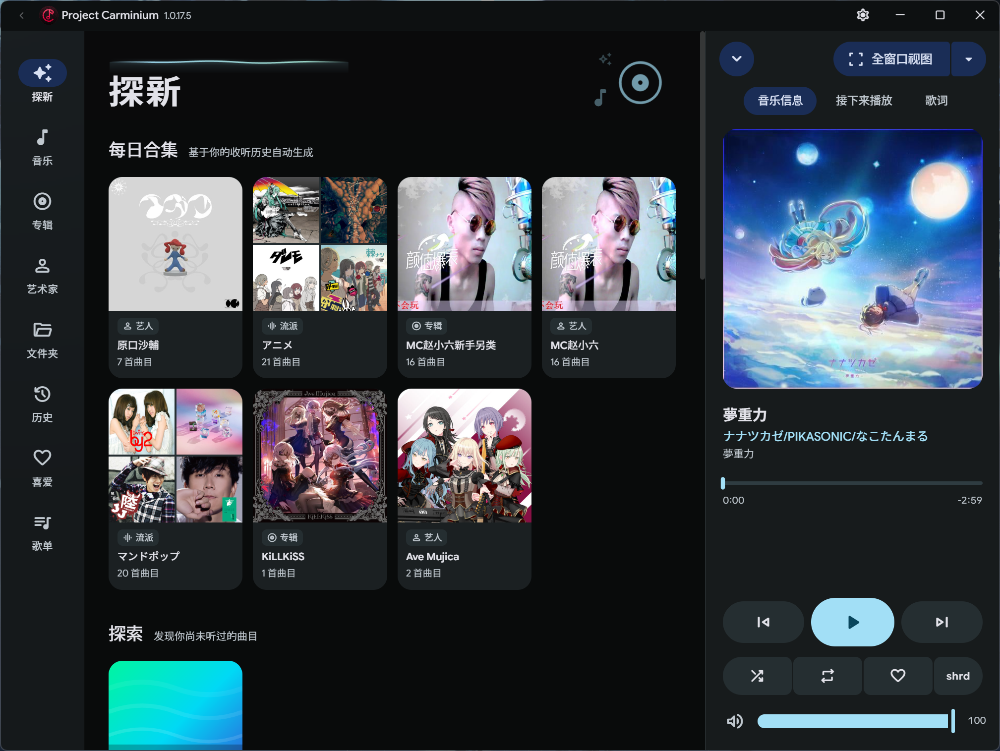
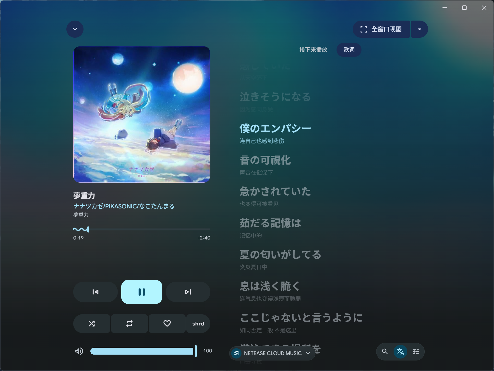
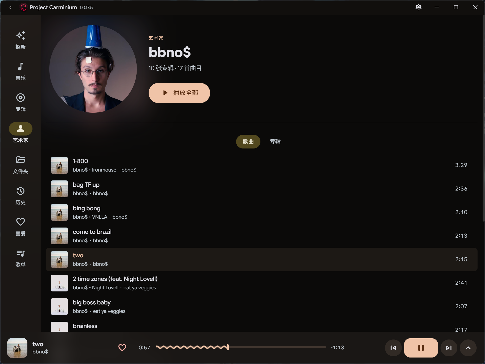
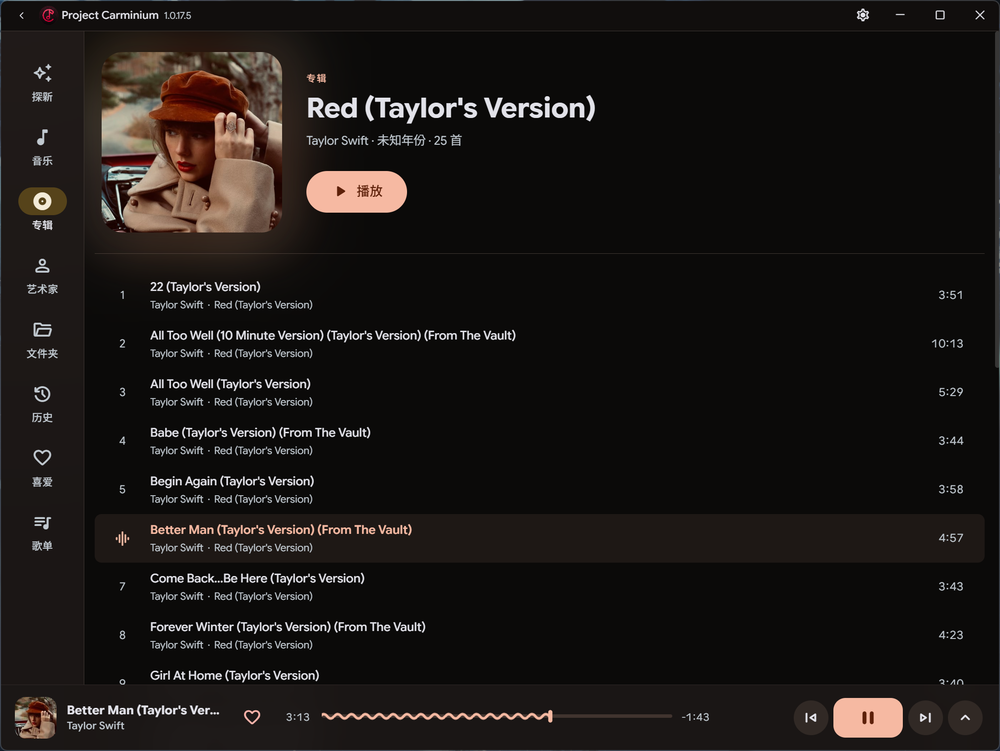

<h1>
  <picture>
    <source media="(prefers-color-scheme: dark)" srcset="build/icon-dark.png" />
    <source media="(prefers-color-scheme: light)" srcset="build/icon.png" />
    
  </picture>
  Project Carminium
</h1>

  专注于 Material You 设计的支持本地/Navidrome/WebDAV 的偏本地音乐播放器

## 概述

Project Carminium 是一款以设计性和使用性为核心的音乐播放器：支持本地音乐库，也支持 Subsonic / OpenSubsonic、WebDAV 与 SMB 远程音乐源；歌词自动从多个在线曲库匹配，并可在正在播放页手动切换来源。

### 聚焦亮点

- **原生音频输出** — WASAPI 独占/共享模式、PulseAudio，支持位完美输出
- **Gapless 无缝播放** — 曲目间零间隙切换
- **自动过渡混音** — 按曲目能量分析自动交叉淡入淡出；BPM 差异较大时上下曲双向对齐节拍再逐渐回落。
- **智能歌词** — 网易云 / QQ 音乐 / lrclib / AMLLDB 多源搜索，支持逐字高亮、QRC 自动解密与翻译/罗马音
- **动态主题** — Material Design 3 动态取色（Monet），从专辑封面取主题色
- **系统集成** — Windows SMTC、全局快捷键、游戏手柄映射

### 下载

- 前往 [Release 页面](https://github.com/Seirai-Haraguchi/Project-Carminium/releases/latest) 下载最新版本：Windows 便携版 `.exe`（解压即用）、Linux `.deb` / `.AppImage`（x64）
- 想尝鲜可在 [Nightly 构建](https://github.com/Seirai-Haraguchi/Project-Carminium/actions/workflows/nightly.yml) 下载每日自动构建（不稳定）

### 支持播放的音乐格式

基本上所有。（如果有播不出来的，Issue 谢谢）

## 界面截图

| 探新界面 | 正在播放界面 |
|---|---|
|  |  |
| 艺人界面 | 专辑界面 |
|  |  |

## 许可证

本项目基于 [LGPL-3.0-or-later](https://www.gnu.org/licenses/lgpl-3.0.html) 许可证开源，在 [LICENSE](LICENSE) 文件了解更多。

### 第三方组件

- [miniaudio](https://github.com/mackron/miniaudio) — MIT / Public Domain
- [SoundTouch](https://gitlab.com/soundtouch/soundtouch) — LGPL-2.1
- [FFmpeg](https://ffmpeg.org/) — LGPL-2.1+ / GPL-2.0+（取决于构建配置）
- [Material Design 3](https://m3.material.io/) — 设计规范（Apache 2.0）

## Star 历史

<a href="https://www.star-history.com/#stars=Seirai-Haraguchi/Project-Carminium&date=all">
<picture>
  <source media="(prefers-color-scheme: dark)" srcset="https://api.star-history.com/svg?repos=Seirai-Haraguchi/Project-Carminium&type=Date&theme=dark" />
  <source media="(prefers-color-scheme: light)" srcset="https://api.star-history.com/svg?repos=Seirai-Haraguchi/Project-Carminium&type=Date" />
  
</picture>
</a>